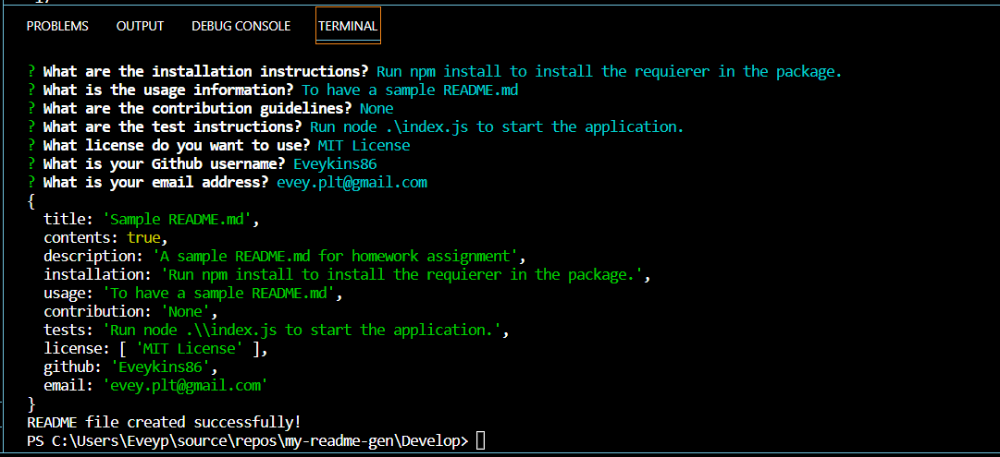

# MY-README-GEN

## Description
A profesional README.md genorator to assist you in creating the README file for your next project and all your future projects. This app uses NODEJS and Inquierer to create the framework for all your README needs.

## Table of Contents
- [Installation](#installation)
- [Usage](#usage)
- [Contribution](#contribution)
- [Tests](#tests)
- [License](#license)
- [Qustions](#qustions)

## Installation
Just run the npm install to get the inquirer installed and you will be ready to get started.

## Usage
Once the npm is installed type node .\index.js and answer the questions. It's that easy.

## Contribution
Just me being awesome!

## Tests
Here is a video demo of the app in action:

https://drive.google.com/file/d/1G6ZPRD7PWvaDRhRgDxV7MeqS45csDvyG/view

Here is a screen shot of the sample README.md that can be located in the Example folder ([./Develop/Example/README.md](./Develop/Example/README.md))

---

## License

This project is licensed under the [MIT License](https://opensource.org/licenses/MIT) license.

## Questions
If you have any questions, you can find me on GitHub:
GitHub: [Eveykins86](https://github.com/Eveykins86)

Feel free to reach out via email:
Email: evey.plt@gmail.com

Happy Coding!